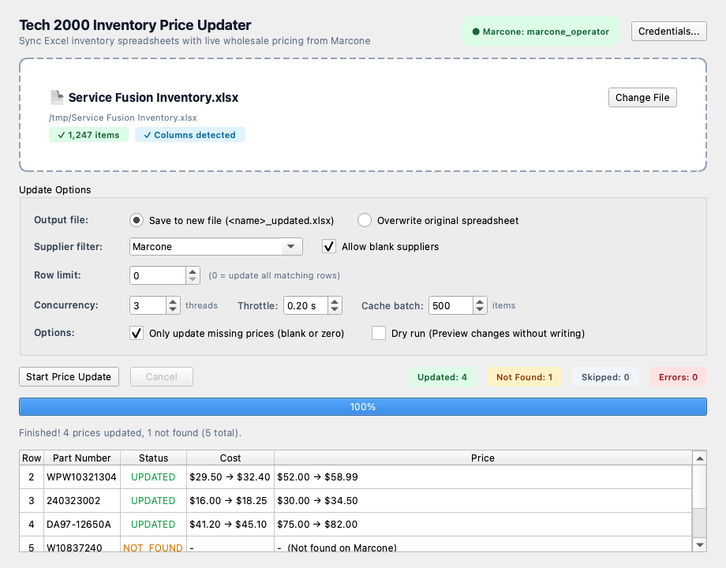

# inventory-updater

Synchronize inventory spreadsheets (`.xlsx`) with pricing from Marcone via desktop GUI or CLI.

## Prerequisites

- Python >= 3.10
- [uv](https://docs.astral.sh/uv/)

## Setup

1. Install workspace dependencies:

```sh
uv sync
```

2. Configure credentials in `.env`:

```sh
cp .env.example .env
```

Set:
- `MARCONE_USERNAME`: Portal username or email.
- `MARCONE_PASSWORD`: Portal password.
- `MARCONE_ACCOUNT_NUMBER`: Customer account number (optional; required if login requires sub-account selection).

Credentials resolve in this order: command line flags, active environment variables, `.env` in the current working directory, `.env` in parent directories, or platform user configuration:
- macOS: `~/Library/Application Support/tech2k-tools/.env`
- Linux: `~/.config/tech2k-tools/.env`
- Windows: `%APPDATA%\tech2k-tools\.env`

Credentials can also be tested and saved through the GUI.

## Desktop GUI

Launch the graphical interface:

```sh
uv run inventory-updater-gui
```



### Features

- Drag-and-drop spreadsheet loading or system file picker.
- Automatic column detection for Part Number, Cost, Price, and Supplier headers.
- Update scope selection: Cost and List Price, Customer Cost Only, or List Price Only.
- Supplier filtering by substring match, plus toggle for blank supplier values.
- Real-time concurrency, request throttling, and SQLite batch query controls.
- Dry run simulation mode and row processing limits.
- Real-time row status streaming table displaying live lookups, updated costs, and list prices.
- Cooperative cancellation without leaving incomplete or corrupt workbooks.
- Post-run buttons to open the result spreadsheet or reveal it in the system file manager.
- Credential management dialog with live portal connection testing.

## CLI Usage

```sh
uv run inventory-updater [options]
```

Default behavior reads `Service Fusion Inventory.xlsx` from the current directory and writes modified rows to `<file>_updated.xlsx`.

### Options

| Option | Description | Default |
| --- | --- | --- |
| `--file, -f FILE` | Input Excel file path | `Service Fusion Inventory.xlsx` |
| `--output, -o OUTPUT` | Output Excel file path | `<file>_updated.xlsx` |
| `--in-place` | Overwrite input file directly | `false` |
| `--field {both,cost,price}` | Pricing fields to update | `both` |
| `--supplier-filter TEXT` | Only update rows where supplier column contains this string | `Marcone` |
| `--no-allow-blank-supplier` | Skip rows where supplier column is blank | `false` (blanks processed) |
| `--set-supplier TEXT` | Overwrite supplier column with this text on updated rows | None |
| `--only-missing` | Only look up rows where cost or price is blank or zero | `false` |
| `--dry-run` | Query prices and report statistics without writing files | `false` |
| `--limit N` | Process at most N matching rows | None |
| `--workers, -w N` | Concurrent lookup threads | `3` |
| `--throttle, --throttle-seconds SEC` | Minimum delay between HTTP requests across threads | `0.2` |
| `--cache-chunk-size, --batch-size N` | Item batch size for SQLite cache lookups | `500` |
| `--lookahead N` | Worker pipeline submission lookahead window | `max(workers * 3, 10)` |
| `--cache-file PATH` | SQLite database file for price cache | `.cache/marcone_prices.sqlite` |
| `--cache-ttl-days DAYS` | Cache entry lifetime in days | `7.0` |
| `--username USER` | Marcone username override | `MARCONE_USERNAME` |
| `--password PASS` | Marcone password override | `MARCONE_PASSWORD` |
| `--account-number NUM` | Marcone account number override | `MARCONE_ACCOUNT_NUMBER` |
| `--verbose, -v` | Enable verbose debug logging | `false` |

### CLI Examples

Preview pricing lookups for the first 5 parts:

```sh
uv run inventory-updater --dry-run --limit 5
```

Update an inventory spreadsheet in place using 5 concurrent workers and 0.3s request throttle:

```sh
uv run inventory-updater --file InventoryItems.xlsx --in-place --workers 5 --throttle 0.3
```

Update only blank or zero costs and prices for Marcone rows:

```sh
uv run inventory-updater --supplier-filter Marcone --only-missing
```

Assign supplier name to Marcone on all updated rows and write to a new file:

```sh
uv run inventory-updater --set-supplier Marcone -o output.xlsx
```

## Performance & Tuning Guidance

### Default Rationales

- **`workers: 3`**: Marcone serves session-authenticated web portal pages. Running 3 concurrent threads yields roughly 2.5x to 3x speedup compared to serial lookups without triggering anti-bot protections or concurrent session invalidation.
- **`throttle_seconds: 0.2`**: Cross-thread throttle lock enforces a minimum 200 ms interval between any outgoing HTTP calls. This caps total request rate to at most ~5 requests/sec across all workers, smoothing traffic spikes.
- **`cache_chunk_size: 500`**: Prior to executing live web requests, all candidate row part numbers are checked against local SQLite cache in chunks of 500 items. This avoids SQL variable expression limits while pre-resolving thousands of parts in single-digit milliseconds.
- **`lookahead: max(workers * 3, 10)`**: Limits how far ahead in the spreadsheet the worker pipeline queues uncached lookups. Keeps worker threads saturated without buffering excessive unwritten state in memory.

### Tuning Strategies

| Scenario | Recommended Setting | Rationale |
| --- | --- | --- |
| Default / Standard sync | `--workers 3 --throttle 0.2` | Balanced throughput and safe request rates. |
| Large catalogs (>5,000 items) on stable connection | `--workers 5 --throttle 0.15` | Accelerates throughput; monitor for portal rate limits. |
| Encountering HTTP 429 or portal connection errors | `--workers 2 --throttle 0.5` | Reduces request frequency and backoff pressure on Marcone. |
| Slow or memory-constrained machines | `--cache-chunk-size 250 --workers 2` | Lowers peak memory consumption per query batch. |
| High-speed batch cache revalidation | `--cache-chunk-size 1000` | Minimizes database round-trips when reading large cache tables. |

## Spreadsheet Column Detection

The tool scans row 1 headers (case-insensitive) to identify column mappings:

| Role | Matching Header Names | Fallback Column |
| --- | --- | --- |
| Part Number | `part no`, `part no.`, `part #`, `partnumber`, `part number`, `part` | 1 |
| Vendor Part Number | `vendor part` | None |
| Cost | `avg. unit cost`, `avg unit cost`, `average unit cost`, `purchase price`, `supplier cost`, `cost` | 8 |
| Price | `unit price`, `price *`, `price` | 10 |
| Supplier | `primary vendor`, `supplier name`, `supplier`, `vendor` | 14 |
| Manufacturer | `manufacturer`, `make` | None |

## Cache

Price lookups are cached in a local SQLite database using write-ahead logging (WAL). The cache records resolved pricing as well as `not_found` responses to avoid repeated network queries.

If running inside a project directory containing `pyproject.toml` or `.cache`, the cache defaults to `.cache/marcone_prices.sqlite`. Otherwise, it uses the platform user cache:
- macOS: `~/Library/Caches/tech2k-tools/marcone_prices.sqlite`
- Linux: `~/.cache/tech2k-tools/marcone_prices.sqlite`
- Windows: `%LOCALAPPDATA%\tech2k-tools\marcone_prices.sqlite`

## Packaging

Build a standalone desktop executable:

```sh
uv run python packaging/generate_icons.py
uv run pyinstaller --clean --noconfirm packaging/inventory_updater.spec
```

Build targets:
- macOS: `dist/Tech2000-InventoryUpdater.app`
- Windows: `dist/Tech2000-InventoryUpdater/Tech2000-InventoryUpdater.exe`


